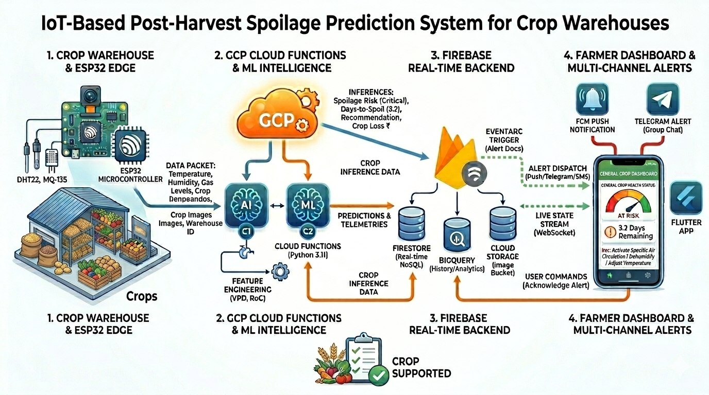

# SmartStore: PostHarvest Spoilage Monitor

**Real-time post-harvest commodity spoilage prediction using IoT sensors, ML models, and a Flutter mobile dashboard.**

Built at **CU NextGen Hack 2026** — PS 12: IoT-Based Post-Harvest Storage Loss Prediction System.

---

## Architecture

```
ESP32 Sensors ──► Google Cloud Functions ──► Firestore
                                                 │                        │
                                           XGBoost Models           Flutter App
                                           BigQuery Logs            (real-time)
ESP32-CAM ─────► Image Upload Function ──► Cloud Storage ──────────────┘
```



---

## Repository Structure

```
.
├── ml/                          # Machine learning pipeline
│   ├── train_model.py           # XGBoost training (risk score + days-to-spoilage)
│   ├── generate_synthetic_data.py
│   ├── data/                    # Training data (CSV)
│   ├── config/                  # Commodity threshold configs
│   └── plots/                   # Generated evaluation plots
│
├── cloud-functions/             # Google Cloud Functions (Gen 2)
│   ├── predict/                 # Spoilage prediction endpoint
│   │   ├── main.py
│   │   ├── requirements.txt
│   │   ├── commodity_thresholds.json
│   │   └── *.pkl                # Trained model artifacts
│   └── image-upload/            # ESP32-CAM image ingestion
│       ├── main.py
│       ├── requirements.txt
│       └── deploy.sh
│
├── firmware/                    # Arduino / ESP32 sketches
│   ├── esp32_sensor/            # Sensor node (temp, humidity, gas)
│   │   └── esp32_sensor.ino
│   └── esp32cam/                # Camera module
│       └── esp32cam.ino
│
├── gateway/                     # Raspberry Pi BLE-to-Cloud gateway
│   └── server.py
│
├── mobile/                      # Flutter mobile dashboard
│   ├── lib/
│   │   ├── main.dart
│   │   ├── models/
│   │   ├── providers/
│   │   ├── screens/
│   │   ├── services/
│   │   ├── theme/
│   │   └── widgets/
│   ├── android/
│   ├── pubspec.yaml
│   └── test/
│
├── backend/                     # Backend API & alert services
│   └── m2-backend/
│       ├── alert-function/      # Firestore-triggered SMS + Telegram alerts
│       ├── api-function/        # REST API for Flutter app
│       ├── scripts/             # Seeding & simulation scripts
│       └── tests/               # Unit & integration tests
│
├── scripts/                     # Utility / setup scripts
│   ├── init_firestore.py        # Initialize Firestore collections
│   ├── seed_historical_data.py  # Seed 24h demo data
│   └── simulator.py             # Hardware-fallback data simulator
│
├── docs/                        # Diagrams & documentation
│   ├── system_overview.png
│   └── sequence-diagram-end-to-end.png
│
├── .gitignore
└── README.md
```

---

## Quick Start

### 1. Train the ML models

```bash
cd ml
pip install numpy pandas xgboost scikit-learn matplotlib
python generate_synthetic_data.py
python train_model.py
```

Models are saved to `ml/*.pkl`. Copy them to `cloud-functions/predict/` before deploying.

### 2. Deploy Cloud Functions

```bash
# Prediction function
cd cloud-functions/predict
gcloud functions deploy predict-spoilage --gen2 --runtime=python312 \
  --entry-point=predict_handler --trigger-http --allow-unauthenticated

# Image upload function
cd ../image-upload
bash deploy.sh
```

### 3. Seed Firestore (demo data)

```bash
cd scripts
python init_firestore.py
python seed_historical_data.py
```

### 4. Run the simulator (demo mode)

```bash
cd scripts
python simulator.py
```

### 5. Run the Flutter app

```bash
cd mobile
flutter pub get
flutter run
```

### 6. Deploy backend services

See [backend/m2-backend/README.md](backend/m2-backend/README.md) for alert & API function deployment.

---

## Supported Commodities

| Commodity | Optimal Temp (°C) | Optimal RH (%) | Shelf Life (optimal) |
|-----------|-------------------|-----------------|----------------------|
| Tomato    | 12 – 15           | 85 – 95         | 14 days              |
| Potato    | 4 – 5             | 95 – 98         | 180 days             |
| Banana    | 13 – 14           | 90 – 95         | 21 days              |
| Rice      | 15 – 20           | 50 – 65         | 365 days             |
| Onion     | 0 – 2             | 65 – 70         | 240 days             |

---

## Tech Stack

- **IoT**: ESP32, ESP32-CAM
- **Cloud**: Google Cloud Functions (Gen 2), Firestore, BigQuery, Cloud Storage, FCM
- **ML**: XGBoost (risk regression + spoilage days regression)
- **Mobile**: Flutter + Riverpod + Firebase SDK
- **Data**: 8,000+ balanced synthetic sensor readings across 5 commodities × 4 scenarios
